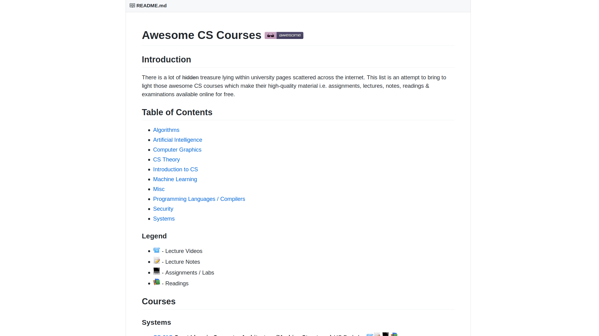

## ¿De NO que va esta charla?

* Como hackear bancos
* Como hackearle el facebook a tu $persona.
* Como hackearle el movil a tus familiares,
* Como conseguir tarjetas de credito ilegales.
* Como aprender a programar.

---

## ¿De que si va?

* No te haras millonario al instante con esta charla.
* Va de aprender a aprender.
* Va de algo de cultura hacker.
* La verdad es que yo tampoco se de que va.

---

## Como ser un hacker: Definiciones

* El diccionario hacker (198x):
  * "Es todo individuo que se dedica a programar de forma entusiasta, o sea un experto entusiasta de cualquier tipo"

--

* RAE:
  * "persona experta en el manejo de computadoras, que se ocupa de la seguridad de los sistemas y de desarrollar técnicas de mejora"

--

* Etimologia:
  * Persona que utiliza una herramienta rudimentaria para realizar una tarea.

--

* Mi filosofia:
  * No sabes nada, pero siempre puedes aprender a hacer algo.

---

## Como ser un Hacker: Manos a la obra

```text
    To follow the path:
    look to the master,
    follow the master,
    walk with the master,
    see through the master,
    become the master.
```

--

## Como ser un Hacker: Manos a la obra

```text
    Sigue el camino:
    mira al maestro,
    sigue al maestro,
    camina con el maestro,
    ve atravez del maestro,
    conviertete en el maestro.
```

---

### Donde aprender: Conocimiento Cognitivo

 * Metaconocimientos que describen conocimientos.
 * Metaconocimientos sobre la utilización o aplicación de conocimientos.
 * Metaconocimientos para descubrir conocimientos.
 * Metaconocimientos sobre la confianza o veracidad de un conocimiento particular.
 * Metaconocimientos sobre el conocimiento que otros tienen.

---

### Donde aprender: Recursos
 * Listas awesome 
 

--

